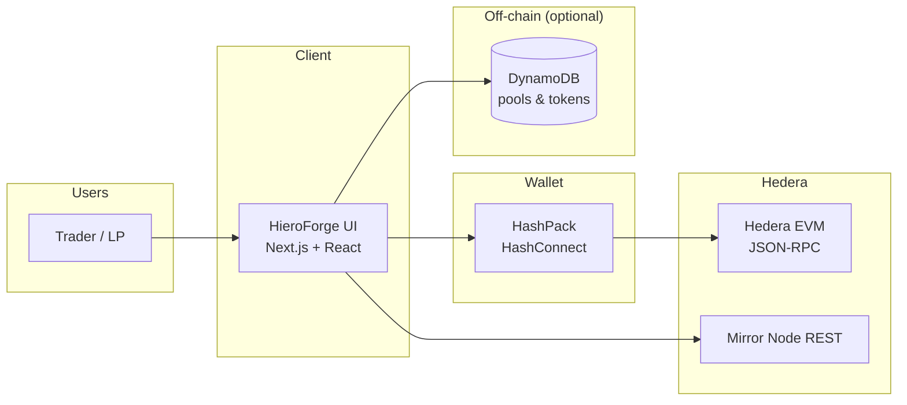
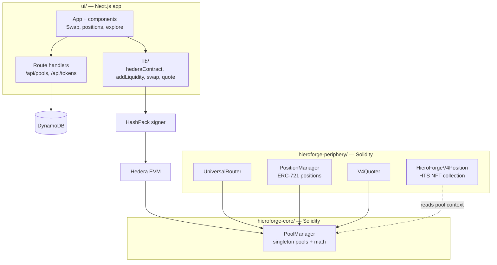
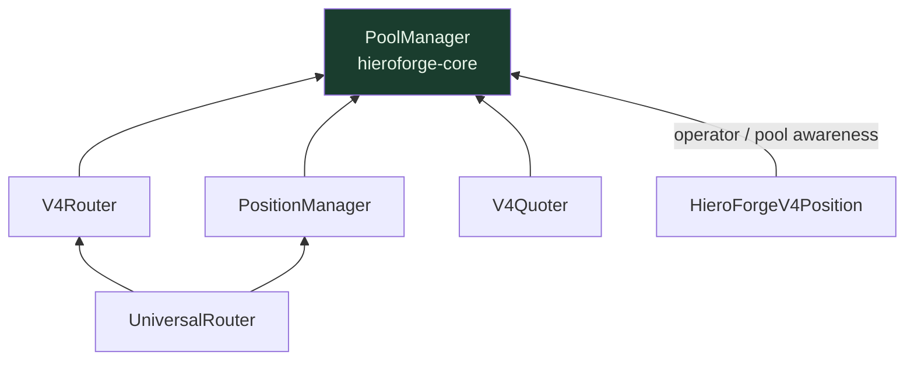
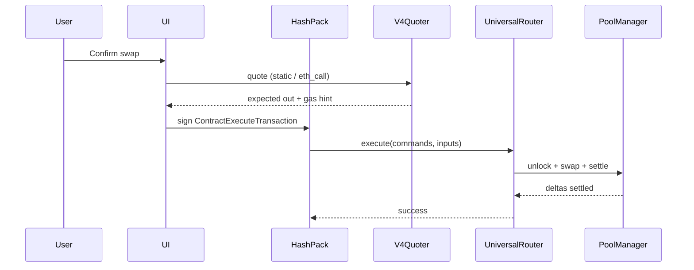
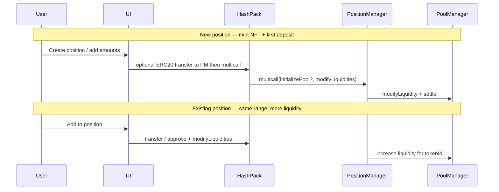
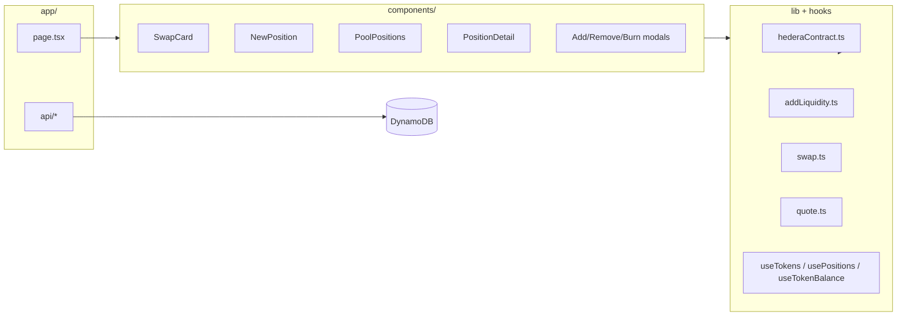

# HieroForge — system architecture

Visual overview of how the **UI**, **off-chain services**, and **on-chain contracts** fit together. HieroForge is a Uniswap V4–style concentrated liquidity AMM on **Hedera** (chain id **296** testnet), with **HTS** token support.

**PoolManager–only deep dive:** **[pool-manager.md](./pool-manager.md)** — singleton state, lock/unlock, deltas, `sync`/`settle`/`take`, hooks.

---

## 1. System context

Who talks to whom at the highest level.



---

## 2. Containers and responsibilities



---

## 3. On-chain dependency graph

All pool state and swap math live in **PoolManager**. Periphery contracts are thin orchestration layers.



| Contract | Role |
|----------|------|
| **PoolManager** | Single contract holding every pool; `swap`, `modifyLiquidity`, deltas / unlock pattern. |
| **UniversalRouter** | User entry: command bytes (`V4_SWAP`, `V4_POSITION_CALL`, …). |
| **V4Router** | Encodes swap steps; pays tokens into the pool manager flow. |
| **PositionManager** | NFT positions; `multicall`, `initializePool`, `modifyLiquidities` (mint / increase / decrease / burn). |
| **V4Quoter** | Static calls that revert with quote results (no state change). |
| **HieroForgeV4Position** | Optional HTS-backed NFT collection (no royalties); separate from standard `PositionManager` ERC-721. |

---

## 4. Swap path (simplified)



---

## 5. Liquidity path (PositionManager NFT)



---

## 6. UI module map (source layout)



---

## 7. Repository layout (monorepo)

```
HieroForge/
├── architecture/          # System diagrams (this README) + PoolManager deep dive (pool-manager.md)
├── hieroforge-core/       # PoolManager, types, libraries, Foundry tests & deploy scripts
├── hieroforge-periphery/  # Router, PositionManager, Quoter, HieroForgeV4Position, scripts/
├── ui/                    # Next.js frontend + API routes
└── .gitmodules            # forge-std, solmate, hedera-forking, etc.
```

---

## Viewing these diagrams

- **GitHub**: Mermaid renders automatically in `README.md` on github.com.
- **VS Code**: Mermaid preview extension, or [mermaid.live](https://mermaid.live).
- **Exports**: Mermaid CLI or mermaid.live → SVG / PNG for slides.
