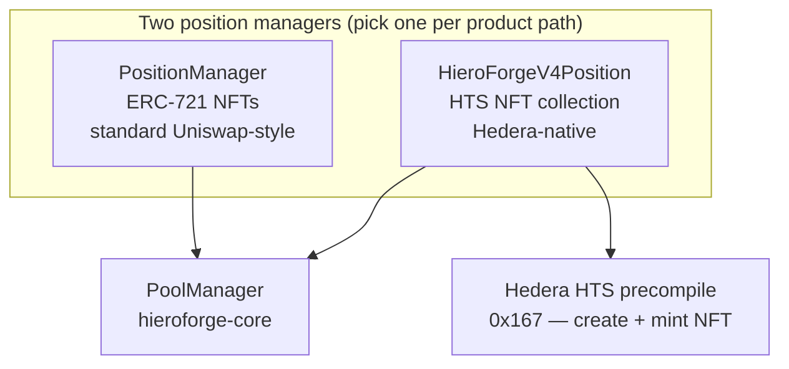
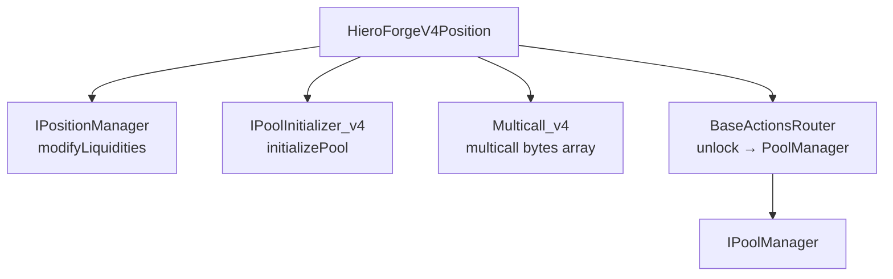
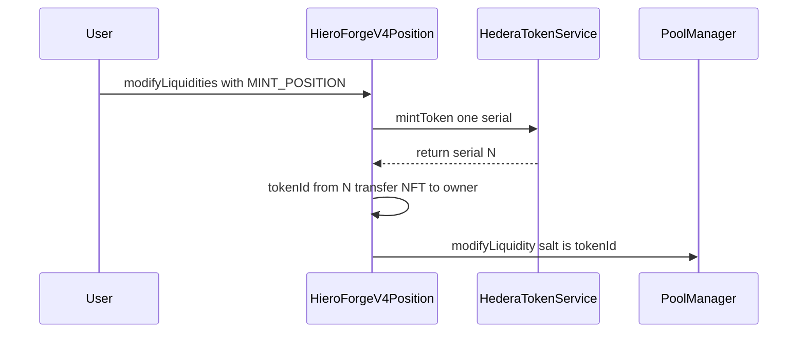
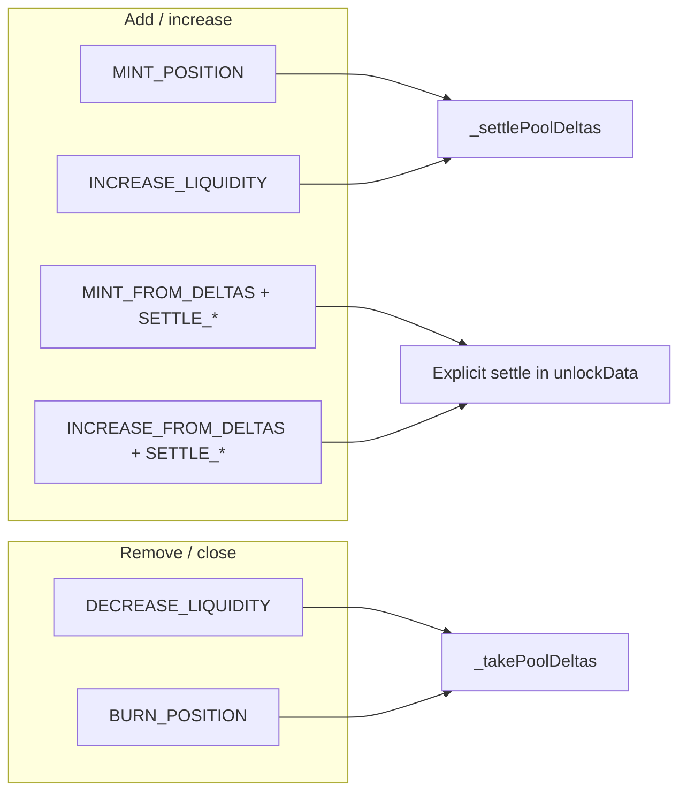

# HieroForgeV4Position architecture

**HieroForgeV4Position** is an alternate **position manager** in `hieroforge-periphery`: it mirrors **PositionManager**’s V4 flow (`modifyLiquidities`, same `Actions` / settlement pattern, same **PoolManager** integration) but represents ownership with a **Hedera Token Service (HTS) NFT collection** (one serial per position) instead of an in-contract **ERC-721**.

For the singleton AMM core, see **[pool-manager.md](./pool-manager.md)**. For the full stack, see **[README.md](./README.md)**.

---

## 1. Role in the system

| Aspect | **PositionManager** | **HieroForgeV4Position** |
|--------|---------------------|---------------------------|
| Position NFT | Contract-minted ERC-721 | HTS non-fungible collection + ERC-721 **mirror** for `ownerOf` / approvals |
| **tokenId** | Monotonic counter (`nextTokenId`) | **HTS serial number** (cast to `uint256`) |
| Deploy / ops | Standard Foundry broadcast | HTS paths need **`--ffi`**, **`--skip-simulation`**, correct **`operatorAccount`** for collection expiry |
| Royalties | N/A (standard NFT) | Collection configured **without** royalties (0% secondary) |

---

## 2. Inheritance and external API

**Same entry pattern as PositionManager**

- **`modifyLiquidities(unlockData, deadline)`** — sets `_executor`, runs **`BaseActionsRouter._executeActions`** → **`PoolManager.unlock`** → action loop (`CalldataDecoder` strict layout).
- **`initializePool`** — forwards to **`PoolManager.initialize`** (no-op if already initialized).
- **`multicall`** — batches encoded calls (e.g. `initializePool` + `modifyLiquidities`).

**HTS / admin–only**

- **`createCollection()`** — `payable`, **`onlyOwner`**, one-shot **`createNonFungibleToken`** via **`IHederaTokenService`**. Sets **`htsTokenAddress`**. Treasury = this contract; **ADMIN** and **SUPPLY** keys held by the contract.
- **`mintNFT(to)`** — **`onlyOwner`**: mints a **standalone** HTS serial to `to` (not a pool position). **Pool positions** are created via **`MINT_POSITION`** inside **`modifyLiquidities`**, which mints via HTS and then runs **`_modifyLiquidity`**.

---

## 3. Position identity: HTS serial and pool salt

On **mint**, the contract:

1. **`mintToken`** on the HTS collection → reads **`serials[0]`**.
2. **`tokenId = uint256(uint64(serials[0]))`** — this is the **canonical id** for `positionInfo`, `positionLiquidity`, and **`ModifyLiquidityParams.salt`** (`bytes32(tokenId)`), same idea as PositionManager’s salt = unique position storage in PoolManager.

**Note:** The contract still exposes **`nextTokenId`** for interface symmetry; **new positions use HTS serials**, not that counter.

---

## 4. Ownership and approvals

- **`_positionOwner(tokenId)`** — **`IERC721(htsTokenAddress).ownerOf(tokenId)`** (mirror contract).
- **`onlyPositionOwnerOrApproved`** — increase / decrease / burn require **`msgSender()`** (the **`_executor`** during `modifyLiquidities`) to be **owner** or **approved** on the HTS mirror, matching ERC-721 semantics.
- **`approve` / `getApproved` / `isApprovedForAll`** — forwarded to the HTS mirror for tooling compatibility.

---

## 5. Liquidity actions (parity with PositionManager)

Internal handlers mirror **PositionManager**: **`_mint`**, **`_increase`**, **`_decrease`**, **`_burnPosition`**, **`_mintFromDeltas`**, **`_increaseFromDeltas`**, plus settlement actions (**`SETTLE`**, **`SETTLE_PAIR`**, **`TAKE`**, **`CLOSE_CURRENCY`**, …).

- **`_settlePoolDeltas`** — **`sync` + transfer** from **this contract** into **PoolManager** + **`settle`** (tokens held on HieroForgeV4Position before mint/increase).
- **`_settleFromUser`** — **`transferFrom(msgSender, poolManager, …)`** for **FROM_DELTAS** + **`SETTLE_PAIR`** style flows.

**Burn:** **`_burnPosition`** removes remaining liquidity / collects fees, **`take`s** to the caller, then **clears** `positionLiquidity` and **`positionInfo`**. Comment in code: the **HTS NFT may still exist** on-chain but **no longer maps** to an active tracked position (behavior to be aware of for wallets and indexers).

---

## 6. Deployment and operations (short)

| Step | Detail |
|------|--------|
| **Core** | Deploy **PoolManager** first; note address. |
| **Deploy HF** | **`DeployHieroForgeV4Position`**: constructor **`(IPoolManager, operatorAccount)`**. **`operatorAccount`** should match the **Hedera ECDSA** account that signs txs (auto-renew / precompile expectations). |
| **Create collection** | **`createCollection()`** with **`msg.value`** / gas as required by network (see deploy script / README). |
| **Liquidity** | Same pattern as PositionManager: fund contract (or approve user), then **`multicall(initializePool, modifyLiquidities)`**. Scripts: **`AddLiquidityHieroForgeV4Position`**, **`TransferToHieroForgeV4Position`**, **`modify-hieroforge-v4-position.sh`**, etc. |

Verification and **HashScan** notes live in **`hieroforge-periphery/README.md`**.

---

## 7. File and test pointers

| Path | Purpose |
|------|---------|
| `hieroforge-periphery/src/HieroForgeV4Position.sol` | Implementation |
| `hieroforge-periphery/script/DeployHieroForgeV4Position.s.sol` | Deploy |
| `hieroforge-periphery/script/AddLiquidityHieroForgeV4Position.s.sol` | Add liquidity via HF |
| `hieroforge-periphery/test/HieroForgeV4Position.t.sol` | Tests (often **`--fork-url` + `--ffi`** for HTS) |

---

## Viewing diagrams

Use the same setup as **[README.md](./README.md)** (GitHub Mermaid, VS Code **Markdown Preview Mermaid Support**, or [mermaid.live](https://mermaid.live)).
