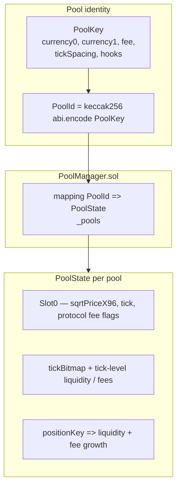
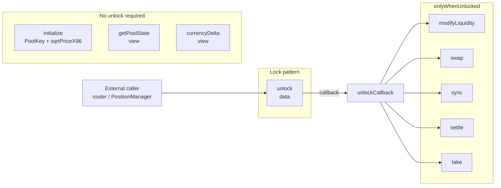
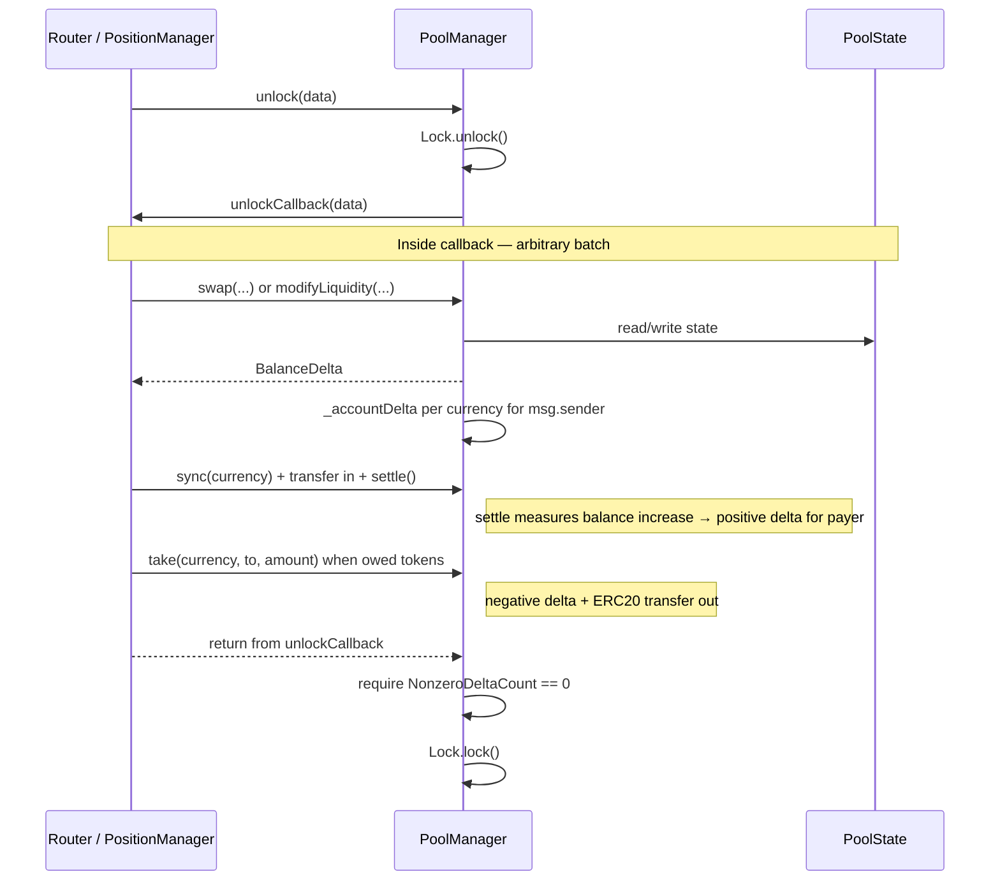
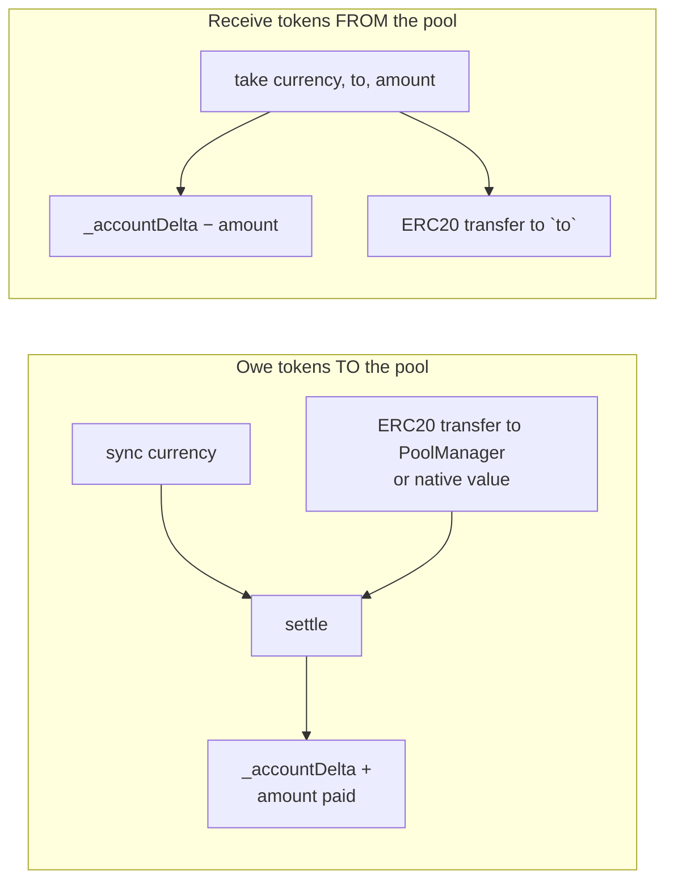

# PoolManager architecture (hieroforge-core)

The **PoolManager** is the singleton AMM engine: every pool’s state, swap math, and liquidity updates live in one contract. Periphery contracts (**UniversalRouter**, **PositionManager**, test routers) never hold long-lived pool state—they call into PoolManager under the **lock / unlock** pattern and settle **currency deltas** before the outer `unlock` returns.

For the full HieroForge stack diagram, see **[README.md](./README.md)** in this folder.

---

## 1. What PoolManager stores

| Concept | Role |
|--------|------|
| **PoolKey** | Canonical pair + fee tier + tick spacing + optional **hooks** contract. `currency0 < currency1`. |
| **PoolId** | `bytes32` hash of the key; used as the mapping key. |
| **PoolState** | Price (`slot0`), tick graph, positions; implements the heavy **swap** and **modifyLiquidity** logic. |

---

## 2. Public entrypoints on PoolManager

- **`initialize`** — Creates pool state at an initial price; may call **beforeInitialize / afterInitialize** hooks.
- **`modifyLiquidity`** — Adds/removes concentrated liquidity; updates ticks and position state; **before/afterModifyLiquidity** hooks; then **accounts deltas** for `msg.sender`.
- **`swap`** — Executes the swap loop inside `PoolState`; **beforeSwap** (optional fee override) / **afterSwap** hooks; **accounts deltas** for `msg.sender`.
- **`unlock`** — Sets transient **lock**, calls `IUnlockCallback(msg.sender).unlockCallback(data)`, then requires **all currency deltas net to zero** (`NonzeroDeltaCount == 0`) before clearing the lock.

---

## 3. Lock / unlock and flash accounting (sequence)

Swaps and liquidity changes **do not** pull tokens inside `swap` / `modifyLiquidity`. They only **record debts and credits** in **transient storage** per `(currency, target)`. The callback **sync + settle + take** (or ERC-20 transfers into the manager) clears those deltas.

If any address still has a non-zero **currency delta** when `unlock` finishes, the call reverts with **`CurrencyNotSettled`**.

---

## 4. Deltas: sync → settle / take

- **`sync`** snapshots “reserves before” for the chosen currency (transient).
- **`settle`** compares current balance to that snapshot and credits the payer’s delta by the increase (or uses `msg.value` for native HBAR).
- **`take`** applies a negative delta to the caller and transfers tokens out.

---

## 5. Hook touchpoints (summary)

When `PoolKey.hooks` is non-zero and the address’s **permission bits** match, PoolManager invokes:

| Phase | Hook (conceptual) |
|-------|-------------------|
| Init | `beforeInitialize` → state init → `afterInitialize` |
| Liquidity | `beforeModifyLiquidity` → `modifyLiquidity` core → `afterModifyLiquidity` |
| Swap | `beforeSwap` (optional LP fee override) → `swap` core → `afterSwap` |

Hooks run **inside** the same transaction as the user operation; they cannot skip delta settlement—the **unlock** epilogue still requires a clean slate.

---

## 6. File map (core package)

Relevant Solidity under **`hieroforge-core/src/`**:

| Path | Responsibility |
|------|----------------|
| `PoolManager.sol` | Singleton; `initialize`, `modifyLiquidity`, `swap`, `unlock`, `sync`, `settle`, `take`, `currencyDelta`, `getPoolState` |
| `types/PoolState.sol` | Tick crossing, swap loop, liquidity updates |
| `types/PoolKey.sol` / `PoolId.sol` | Identity and validation |
| `types/Currency.sol` | Transient **per-(currency,target)** deltas |
| `libraries/Lock.sol` / `NonzeroDeltaCount.sol` | Transient lock + unsettled delta counting |
| `libraries/Hooks.sol` | Optional external hook calls |
| `callback/IUnlockCallback.sol` | `unlockCallback(bytes)` |

---

## 7. Callers (outside core)

Typical **msg.sender** into `unlock`:

- **PositionManager** (periphery) — `modifyLiquidities` → actions that call `modifyLiquidity` / settlement.
- **UniversalRouter** / **V4Router** — swap commands batched with pays and settles.
- **Test Router** (`hieroforge-core/test/utils/Router.sol`) — minimal unlock wrapper for Foundry tests.

All of them implement **`IUnlockCallback`** and drive **`sync` / `settle` / `take`** so **`CurrencyNotSettled`** never fires at the end of `unlock`.
